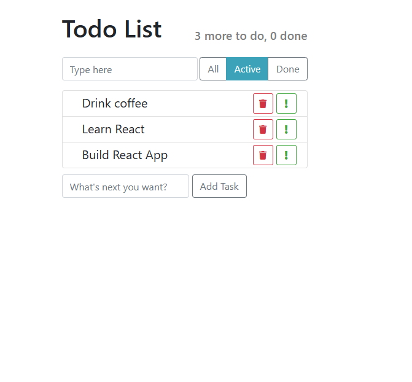

# Todo App

Веб-приложение написано на языке JavaScript с использованием библиотеки React и собрано при помощи Vite



## Описание

Простое и удобное приложение для управления вашими задачами.

Todo App – это веб-приложение, которое позволяет пользователям создавать списки задач, управлять ими и отслеживать прогресс выполнения. Приложение предоставляет удобный интерфейс для добавления новых задач, а также пометки выполненных дел.

## Функции

-  Добавление новых задач
-  Пометка задач как важные
-  Пометка задач как завершенных
-  Фильтрация задач по статусу (все, активные, завершенные)
-  Удаление задач

## Инструкции по установке и запуску

### Требования

Для работы приложения вам потребуется:

-  Node.js версии 14 или выше
-  npm или yarn

### Установка

1. Клонируйте репозиторий:

```bash
https://github.com/demargorn/todo-app_react-vite.git
```

2. Перейдите в директорию проекта:

```bash
cd todo-app_react-vite
```

3. Установите зависимости:

```bash
npm install
# или, если используете yarn:
yarn install
```

4. Запустите приложение:

```bash
npm start
# или, если используете yarn:
yarn start
```

Приложение будет доступно по адресу http://localhost:5173.

## Контакты

Если у вас есть вопросы или предложения, пожалуйста, свяжитесь со мной в Telegram: **@demargorn** или по электронной почте: __demargorn@gmail.com__.
